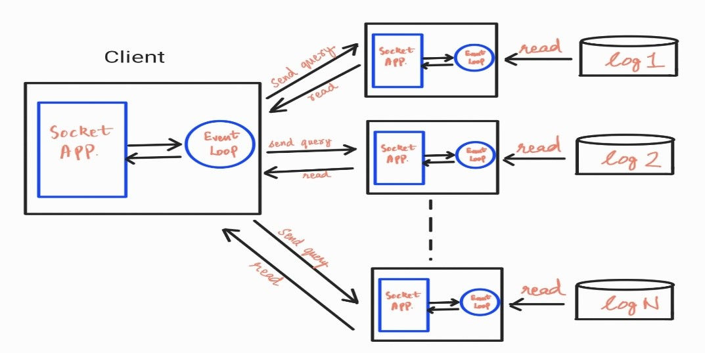
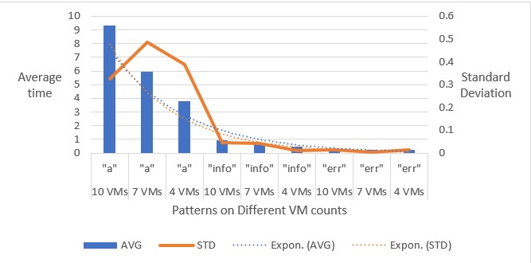

# AwesomeLogRetreiver

AwesomeLogRetreiver is a client/server applications which can be used to query distributed log files on multiple machines. The applications provides grep like interface on files distributed on multiple machines.

## Design
We have gone with a simple distributed architecture where the client sends the search queries to the individual servers. The servers then run the grep commands locally and sends back the outputs to the clients. Since querying and fetching the results are I/O operations, we have utilized the default “asyncio” library in Python. Using “asyncio” we have employed a single-threaded, single-process design which achieves concurrency using an event loop. On the server side, for each connected client, we add a task in the event loop. As soon as a query is received from a connected client, we execute its task from the event loop and return the outputs back to client. On the client end, for each server connection, we create a task in the event loop. We then execute all tasks and wait for every task to complete.



## Performance
We tested our solution by search a frequent pattern (“a”), a somewhat frequent pattern (“info”) and a rare pattern (“err”) on 10, 7 and 4 VMs each. Each log file on a VM is of the size 60MB.  Below is the performance time (in seconds). 

| Machine count | Pattern | Average | Standard Deviation |
|---------------|---------|---------|--------------------|
| 10 VMs        | "a"     | 9.336   | 0.325122           |
| 7 VMs         | "a"     | 5.96    | 0.484454           |
| 4 VMs         | "a"     | 3.76    | 0.389276           |
| 10 VMs        | "info"  | 0.956   | 0.046733           |
| 7 VMs         | "info"  | 0.7     | 0.040694           |
| 4 VMs         | "info"  | 0.46    | 0.011662           |
| 10 VMs        | "err"   | 0.286   | 0.013565           |
| 7 VMs         | "err"   | 0.25    | 0.004899           |
| 4 VMs         | "err"   | 0.22    | 0.013565           |

Below are the match counts for each pattern

| Machine count | Pattern | Match count |
|---------------|---------|-------------|
| 10 VMs        | "a"     | 2709264     |
| 7 VMs         | "a"     | 1899395     |
| 4 VMs         | "a"     | 1091212     |
| 10 VMs        | "info"  | 270780      |
| 7 VMs         | "info"  | 190086      |
| 4 VMs         | "info"  | 109274      |
| 10 VMs        | "err"   | 40013       |
| 7 VMs         | "err"   | 27817       |
| 4 VMs         | "err"   | 15893       |

The results were as expected. We observed that the frequent pattern took the most time and for each pattern, the average time taken scales linearly with the number of connected VMs. We also observed that the standard deviation for all test cases is less than 1 which implies that the running times are consistent. This is also highlighted by the fact that the trendlines for St. Deviation and Average are almost identical.




## Server Application

This is a simple python application which will listen on a configured port for search queries from multiple clients and searches a single log file or multiple log files in a directory based on the user query.

There are two implementations of servers available `server_with_asyncio.py` using python asyncio module to listen for client connections and handle client requests asynchronously and `server_with_selects.py` uses linux `select` to monitor the sockets for reading and sending data.

### Requirements

1. `python` >= `3.8.x` is required to run server application. The server application is developed using in-built python modules and no additional modules are required.

### How To Use This

1. Navigate to `server` folder.
2. Run server application with port, hostname and logfile details. `python3 server_with_asyncio.py --hostname=<hostname or ip> --port=<server port for listening> --logfile=<path to a log file>`.

```
$ python3 server_with_asyncio.py --hostname='127.0.0.1' --port=8000 --logfile='logs/machine.log'
Got a connection from ('127.0.0.1', 52736)
Got query from ('127.0.0.1', 52736): b"search ['blockMap']"
sending 50977 bytes
closing client connection: ('127.0.0.1', 52736)
```

## Client Application

This is a simple python application which provides CLI interface to users to input search queries which will internally forwards the requests to multiple machines and displays the search results from different machines as if the search is performed on files locally. The client application lets users to search multiple patterns including regex in a single query.

### Requirements

1. `python` >= `3.8.x` is required to run client application. The client application is developed using in-built python modules and no additional modules are required.

### How To Use This

1. Navigate to `client` folder.
2. Fill in all the servers information as `<hostname or ip>, <port>` in the `servers.conf` file in any directory.
3. Run client application `python3 client.py --config=<full path to config file> --logsToConsole=<True/False>`.
4. choose option `1` to display configured servers loaded from config file.
5. choose option `2` to input search query in the following format `search ['<search string 1 or regex>', <search string 2 or regex>' ...]`.

```
$ python3 client.py --config='servers.conf' --logsToConsole=True
-------------------------------
1. Display current servers
2. Search logs
3. exit
choose one of the following options: 1
servers:
1: ('127.0.0.1', 8000)
-------------------------------
1. Display current servers
2. Search logs
3. exit
choose one of the following options: 2
Enter search query (Ex: 'search ['query1', 'query2]'): search ['blockMap']
fetching logs from all the servers ...
logs from server (127.0.0.1:8000):
logs/machine.log: 314
081109 204005 35 INFO dfs.FSNamesystem: BLOCK* NameSystem.addStoredBlock: blockMap updated: 10.251.73.220:50010 is added to blk_7128370237687728475 size 67108864
081109 204132 26 INFO dfs.FSNamesystem: BLOCK* NameSystem.addStoredBlock: blockMap updated: 10.251.43.115:50010 is added to blk_3050920587428079149 size 67108864
081109 204324 34 INFO dfs.FSNamesystem: BLOCK* NameSystem.addStoredBlock: blockMap updated: 10.251.203.80:50010 is added to blk_7888946331804732825 size 67108864
...

matched line count per server: 
('127.0.0.1', 8000): 314
Total matched line count for all server: 314
Total runtime to fetch all the logs: 0.1149213314056396 seconds
-------------------------------
1. Display current servers
2. Search logs
3. exit
choose one of the following options: 3
```

## Testing

To test the client and server functionality the `tests` directory contain a testing application. The testing application is a CLI application which tests applications by connecting to servers running on multiple machines and tests the output of client application for `Frequent` and `Infrequent` search patterns and also tests the scenario when servers crashed. We assume that the servers are already running on the test machines. The test application validates the number of log lines and actual log output for each server.

```
tests
    ├── config
    │   └── test_servers_details.json
    └── test_distributed_log_retrival.py
```

### How To Use This

1. Navigate to `tests` folder.

2. Run `python3 test_distributed_log_retrival.py`.

2. Choose the option to execute the test cases.

```
$ python3 test_distributed_log_retrival.py
-------------------------------
1. Run infrequent pattern test.
2. Run frequent pattern test.
3. Run invalid server test.
4. Run all tests.
5. Exit
choose one of the following options: 4
Testing log retriver for infrequent log pattern.
starting server applications
sending query (search ['subdir38']) to all the configured servers.
closing client connection: ('127.0.0.1', 54668)
validating server (127.0.0.1:8000) logs:
PASS
validating server (127.0.0.1:8001) logs:
PASS
Testing log retriver for frequent log pattern.
starting server applications
server applications already started
sending query (search ['a']) to all the configured servers.
validating server (127.0.0.1:8000) logs:
PASS
validating server (127.0.0.1:8001) logs:
PASS
Testing log retriver for invalid servers.
sending query (search ['subdir38']) to all the configured servers.
logs from server (127.0.0.1:8090):
Failed to fetch logs from server with Exception ([Errno 61] Connect call failed ('127.0.0.1', 8090))
logs from server (127.0.0.1:8091):
Failed to fetch logs from server with Exception ([Errno 61] Connect call failed ('127.0.0.1', 8091))
validating server (127.0.0.1:8090) logs:
PASS
validating server (127.0.0.1:8091) logs:
PASS
```
